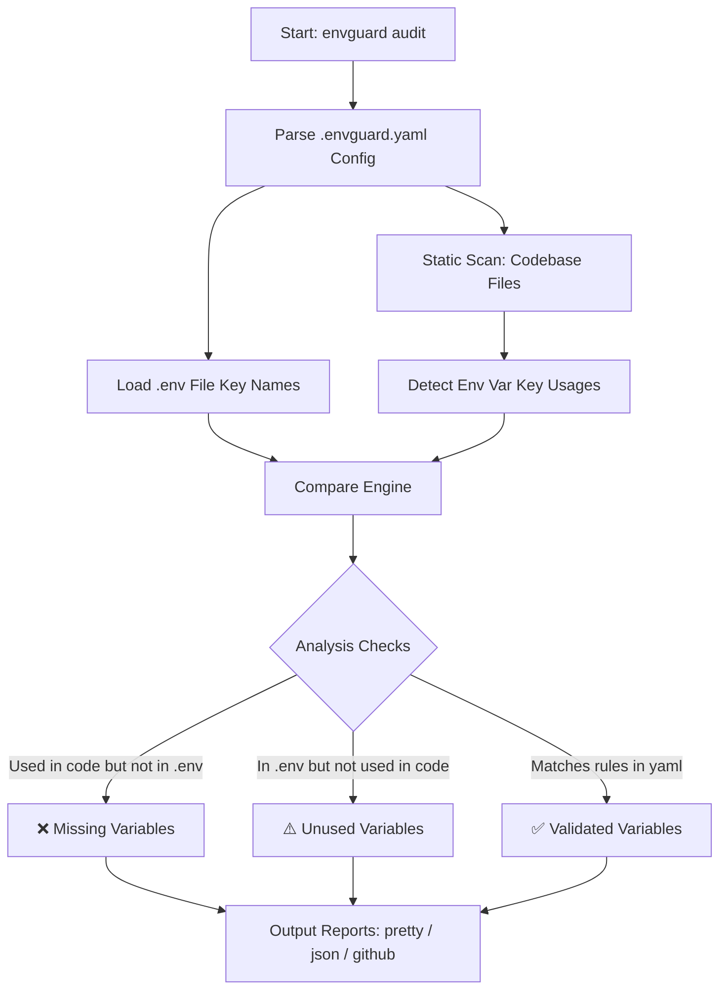

<p align="center">
  
</p>

# envguard 🛡️

[](https://github.com/Vamshavardhan50/envguard/actions/workflows/ci.yml)
[](https://github.com/Vamshavardhan50/envguard/actions/workflows/release.yml)
[](https://www.npmjs.com/package/envguard-bin)
[](https://opensource.org/licenses/MIT)

> **Think of `envguard` as a spell-checker/linter for your environment variables.**
> It scans your code, checks your `.env` files, and makes sure you never break your app in production due to a missing or misconfigured setting. It is fast, works 100% offline, and requires zero configuration to start.

---

## 🔍 How it Works

Unlike traditional validators that only verify `.env` files against static templates, `envguard` performs **static code analysis** to discover environment variables actually referenced in your source files, validating them directly.



---

## ⚡ Quickest Way to Run (No Install Required)

If you have **Node.js** installed, you can run `envguard` instantly with a single command — no global install needed:

```bash
# Initialize envguard in your project (one-time setup)
npx envguard-bin init

# Audit your environment variables
npx envguard-bin audit
```

That's it. `npx` downloads and runs `envguard` automatically.

---

## 📦 Install it Globally (Run Anywhere)

If you prefer to use `envguard` as a global command without typing `npx` every time:

```bash
# Using Node.js (NPM) — recommended
npm install -g envguard-bin

# Using Python (PIP)
pip install envguard-bin

# Using Go
go install github.com/Vamshavardhan50/envguard@latest
```

Once installed, you can run it from any project folder:

```bash
envguard init    # Set up your project (run once)
envguard audit   # Scan your project for issues
```

---

## 🛡️ Why envguard?

Traditional dotenv validators only check if files exist, often causing config drifts or shipping raw secrets. Here is how `envguard` elevates your workflow:

| Feature | `envguard` 🛡️ | Standard `.env` Validators |
| :--- | :--- | :--- |
| **Static Code Scanning** | ✅ Yes (Auto-detects references in code) | ❌ No (Only compares `.env` with `.env.example`) |
| **Privacy First** | ✅ Yes (Strictly reads key names, never logs secrets) | ⚠️ Partial (Often reads/outputs full secret values) |
| **Multi-Language Support** | ✅ Yes (Go, Python, JS/TS, Ruby, Rust, PHP, Java, Shell, Docker) | ❌ No (Usually tied to a single language runtime) |
| **Type & Enum Validation** | ✅ Yes (Configurable rules via YAML) | ⚠️ Limited (Requires runtime specific validator libraries) |
| **Zero-Config Default** | ✅ Yes (Runs instantly out of the box) | ❌ No (Requires manually maintaining templates) |
| **Offline Support** | ✅ Yes (100% offline, zero tracking) | ✅ Yes |

---

## What is envguard?

Have you ever deployed an app, only for it to immediately crash because you forgot to copy a new API key to the server? Or because someone configured `PORT` as a word instead of a number?

`envguard` solves this by automatically finding all environment variables your code uses (like `process.env.DATABASE_URL` or `os.environ.get('PORT')`) and checking them against your `.env` configuration file. It warns you about:

- ❌ **Missing variables** — your code uses them but they are not configured.
- ⚠️ **Unused variables** — they are in `.env` but your code doesn't actually use them.
- 🚫 **Invalid formats** — e.g. a database URL that is not a valid URL, or a port that is not a number.

---

## 🔒 Security & Privacy First

- **100% Offline:** `envguard` never makes network requests and never uploads anything.
- **Privacy-Engineered:** It only reads and displays the **names** of the keys (e.g. `STRIPE_API_KEY`). It **never** reads, logs, or prints the actual secret values.

---

## 🛠️ All Commands

Here are all the commands `envguard` supports:

| Command | What it does |
| --- | --- |
| `envguard init` | Scan your project and create a `.envguard.yaml` config file |
| `envguard audit` | Find missing or unused environment variables |
| `envguard validate` | Check that values match defined rules (type, format) |
| `envguard sync --force` | Auto-generate a clean `.env.example` from your `.env` |
| `envguard doctor` | Run a full project health check (gitignore safety, file integrity) |

---

## ⚙️ Advanced Configuration (`.envguard.yaml`)

You can customize how `envguard` behaves by editing your `.envguard.yaml` file. Here is an example:

```yaml
version: 1

scan:
  paths:
    - "."
  ignore:
    - "node_modules"
    - ".git"
    - "dist"
  languages:
    - auto # Auto-detects JavaScript, TypeScript, Python, Go, Rust, Ruby, Dockerfiles, etc.

# Define rules for validating values
rules:
  DATABASE_URL:
    required: true
    type: url
    description: "Primary PostgreSQL database URL"
  PORT:
    required: false
    type: number
    default: "3000"
    description: "The port the web server runs on"
  NODE_ENV:
    required: true
    type: enum
    values:
      - development
      - production
      - test
```

---

## 🤖 Integrate with GitHub Actions (CI/CD)

Add `envguard` to your CI pipeline to automatically block pull requests with invalid or incomplete environment configurations:

```yaml
name: Guard Environment

on:
  push:
    branches: [main]
  pull_request:
    branches: [main]

jobs:
  audit:
    runs-on: ubuntu-latest
    steps:
      - uses: actions/checkout@v4
      - name: Install envguard
        run: npm install -g envguard-bin
      - name: Run audit
        run: envguard audit --ci
```

---

## 🙋 Frequently Asked Questions (FAQ)

### Does `envguard` send my secrets to a third-party server?
**No.** `envguard` runs entirely on your local machine. It does not send any telemetry, analytics, or credentials over the internet.

### What languages does the code scanner support?
`envguard` scans JavaScript (`process.env.VAR`), TypeScript, React/Vue (`import.meta.env.VAR` or `process.env.VAR`), Python (`os.environ`), Go (`os.Getenv`), Ruby, Rust, PHP, Java, Shell scripts, and Dockerfiles out-of-the-box.

### How is this different from other dotenv validators?
Unlike most tools, `envguard` does not just check if a `.env` file exists. It **statically scans your source code files** to find what keys your code actually references, highlighting code references that are completely missing from your config.

### I installed it with `npm install -g envguard-bin` but the command is not found. What do I do?
Make sure your global npm bin folder is in your system `PATH`. You can find it by running `npm bin -g`. On Windows, this is usually `C:\Users\<YourName>\AppData\Roaming\npm`.

---

## 🌟 Star History & Support

If you find `envguard` useful, please support the project by starring this repository! Your stars help keep the development of offline-first tools active and help other developers discover us.

[](https://star-history.com/#Vamshavardhan50/envguard&Date)

---

## 📄 License
This project is open-source software licensed under the [MIT License](LICENSE).
