# 🚀 Launch Materials & Promotion Playbook

This document contains copy templates to run a coordinated launch and drive star velocity for `envguard`.

---

## 📅 The Ultimate Launch Calendar

```mermaid
gantt
    title envguard Launch Timeline
    dateFormat  X
    axisFormat %d
    
    section Setup
    Pre-Launch Verification   :active, 0, 1
    
    section Day 0 (Launch)
    Product Hunt Launch       :crit, 1, 2
    Hacker News (Show HN)     :crit, 1, 2
    Reddit Posts              :crit, 1, 2
    Peerlist / Indie Hackers  :1, 2
    
    section Day 1 (Content)
    Dev.to Blog Post          :2, 3
    Hashnode (Canonical URL)   :2, 3
    
    section Day 2 (Outreach)
    Submit to Awesome Lists   :3, 4
    Submit to Directories     :3, 4
    Newsletter Submissions    :3, 4
```



### 🛠️ Step 0: Pre-Launch (Day before launch)
*Goal: Ensure the repo is perfect before traffic hits.*
*   [ ] Run `.\envguard.exe doctor testdata/js-project` one last time to confirm it runs cleanly.
*   [ ] Double-check that your GitHub repository page shows the new visual banner correctly in the README.
*   [ ] Verify that your `.gitignore` and issue templates are pushed to the remote repository on GitHub.

### 🚀 Step 1: Launch Day (Day 0)
*Goal: Drive maximum star velocity within a 12-hour window.*
*   [ ] **08:00 AM EST - Product Hunt:** Post on [Product Hunt](https://www.producthunt.com/posts/new) using Section 3 assets.
*   [ ] **09:00 AM EST - Hacker News:** Post on [Hacker News](https://news.ycombinator.com/submit) using Section 1 assets.
*   [ ] **10:00 AM EST - Reddit:** Post on [Reddit](https://www.reddit.com/submit) using Section 7 copy (text post with link in comment).
*   [ ] **11:00 AM EST - Socials:** Post on [Peerlist](https://peerlist.io) & [Indie Hackers](https://www.indiehackers.com) using Section 7.

### 📝 Step 2: Content Multiplication (Day 1)
*Goal: Capture organic traffic search results and long-term interest.*
*   [ ] **09:00 AM EST - Dev.to:** Publish the blog post (Section 4) on [dev.to/new](https://dev.to/new).
*   [ ] **09:30 AM EST - Hashnode:** Publish the same post (Section 10) on [hashnode.com/create/story](https://hashnode.com/create/story). Set the canonical URL pointing to your Dev.to post URL.

### 🌐 Step 3: Directories & Curated Outreach (Day 2)
*Goal: Establish permanent listings and email newsletter features.*
*   [ ] **Awesome Lists:** Submit a pull request on [Awesome Go](https://github.com/avelino/awesome-go) using Section 6.
*   [ ] **Directories:** List on [AlternativeTo](https://alternativeto.net/software/new/), [StackShare](https://stackshare.io/tools/new), and [BetaList](https://betalist.com/submit) using Sections 5, 8, and 9.
*   [ ] **Newsletters:** Submit to *Go Weekly* (via [cooperpress.com](https://cooperpress.com/)) and *Console.dev* (via [console.dev/submit/](https://console.dev/submit/)).

---

## 1. Hacker News (Show HN)
*Hacker News users love technical details, speed, and privacy. Keep it educational and write as a builder.*

*   **Submission Title:** `Show HN: Envguard – Like ESLint but for your environment variables`
*   **Target Link:** `https://github.com/Vamshavardhan50/envguard`
*   **Launch Comment Template:**
    ```text
    Hi HN!

    I built envguard because I was tired of production deployments failing due to missing or incorrectly typed environment variables.

    Most dotenv packages or linters only check if a ".env" and a ".env.example" file have matching keys. However, they don't actually know if your codebase is referencing variables that you forgot to declare, or if values like ports or database URLs are formatted correctly.

    Envguard addresses this by statically scanning your source files to detect actual env var usages (like `process.env.DB_URL` in JS/TS, `os.environ.get("PORT")` in Python, or `os.Getenv("API_KEY")` in Go) and checking them against your configured rules.

    Core technical details:
    - **Go Engine:** Built in Go for high performance. It uses a concurrent file scanner (worker pool) with custom regex patterns to scan codebases in milliseconds.
    - **Offline-First & Privacy:** It runs 100% offline and is secure by design. It only reads and validates environment variable keys—it never reads, logs, or prints the actual secret values.
    - **Type & Enum Checks:** Validates rules in `.envguard.yaml` (supporting string, number, boolean, url, and enum constraints).
    - **Language agnostic:** Support for JS/TS, Python, Go, Ruby, Rust, PHP, Java, Shell, and Docker out of the box.

    It also has NPM and PIP wrappers, meaning you can run it immediately with zero setup via `npx envguard-bin audit`.

    I'd love to hear your feedback on the architecture and rules engine!
    ```

---

## 2. Reddit Posts

### Subreddit: `r/golang`
*Focus on the Go implementation, performance, and tooling.*
*   **Title:** `I built envguard, an offline-first env linter and validator written in Go`
*   **Post Body:**
    ```text
    Hey gophers,

    I wanted to share a CLI tool I've been building called `envguard` (https://github.com/Vamshavardhan50/envguard).

    It's an environment variable validator and linter. Unlike standard dotenv checkers, it statically parses files across your codebase to find out what env keys are actually being used, matching them against `.env` declarations and `.envguard.yaml` schema rules (type checking for URLs, numbers, enums, etc.).

    The core scanner is written in Go. I implemented a simple worker pool walking the filepath tree concurrently, running regex matchers against files based on extension, and aggregating variables. 

    Features:
    - `envguard audit` to find missing/unused environment variables.
    - `envguard validate` to type-check values.
    - `envguard sync` to auto-generate `.env.example` templates.
    - `envguard doctor` to do project safety health checks (e.g. check if `.env` is accidentally committed to git).

    Check out the repo, and let me know what you think of the architecture or how I can improve the regex patterns!
    ```

### Subreddit: `r/node` / `r/webdev`
*Focus on developer pain points: crashes, configuration drift, and broken CI pipelines.*
*   **Title:** `Never break a production deploy due to a missing environment variable again`
*   **Post Body:**
    ```text
    Hey everyone,

    We've all been there: you push a new feature to production, and it crashes instantly because someone forgot to add a new third-party API key to the production dashboard, or because someone set a `PORT` as a string instead of a number.

    I built `envguard` (https://github.com/Vamshavardhan50/envguard) to act like ESLint for your env config.

    Instead of manually checking `.env` files, envguard statically scans your code to detect references like `process.env.STRIPE_KEY` or `import.meta.env.VITE_URL`, and automatically warns you if they aren't declared in `.env` or don't match validation rules (URL, number, enum, etc.).

    You don't need to install anything to try it in your Node project:
    `npx envguard-bin audit`

    It also compiles to a fast, standalone binary, so it's simple to add to your GitHub Actions CI configuration to block PRs with broken configurations.

    Would love to hear how you handle env validation on your team and if this would be useful in your workflow!
    ```

---

## 3. Product Hunt Campaign

*   **Product Name:** `envguard`
*   **Tagline:** `Like ESLint but for your environment variables`
*   **Description:**
    ```text
    Avoid production crashes caused by missing or misconfigured settings. envguard statically scans your code to automatically audit, type-check, and safeguard your environment variables. 

    ⚡ Fast, works 100% offline, and requires zero configuration.
    🔒 Privacy-engineered: reads key names, never reads or logs secret values.
    📦 Runs instantly in any JS/TS, Python, or Go project via npx or pip.
    ```

---

## 4. Dev.to Post (Markdown Article)

*   **Title:** Stop letting missing environment variables crash your production builds
*   **Publishing Tags:** `opensource`, `showdev`, `devops`, `security`
*   **Cover Image:** Reference the generated banner (`assets/envguard_banner.png`) or upload it to Dev.to.
*   **Post Content:**

```markdown
We’ve all experienced it. You push a new feature to staging or production, the deployment finishes, and then... a sudden crash. 

You open the logs only to find a familiar error: `process.env.STRIPE_API_KEY is undefined` or `invalid port: "3000px"`.

Someone added a new third-party API key to the codebase, or defined a PORT as a word instead of a number in their local environment, but forgot to update the staging configurations.

To solve this problem once and for all, I built **[envguard](https://github.com/Vamshavardhan50/envguard)**: an offline-first linter and validator for environment variables, written in Go.

---

## What is envguard?

Traditional dotenv validators only check if files exist, often causing config drifts. **envguard** is different: it statically scans your codebase files to find what environment variables your code is *actually* referencing, and validates them against your `.env` configuration file.

It warns you about:
- ❌ **Missing variables:** Your code uses them (e.g. `process.env.DB_URL`), but they are not defined in `.env`.
- ⚠️ **Unused variables:** They exist in `.env`, but your code doesn't actually use them.
- 🚫 **Invalid formats:** A database URL that isn't a valid URL, or a port that is not a number.

---

## ⚡ Zero-Install Quick Start

If you have Node.js installed, you can scan your project instantly without installing anything:

```bash
# Set up a validation config (one-time setup)
npx envguard-bin init

# Audit your environment variables
npx envguard-bin audit
```

If you prefer to run it globally or use other languages:

```bash
# Go
go install github.com/Vamshavardhan50/envguard@latest

# Python
pip install envguard-bin

# NPM
npm install -g envguard-bin
```

---

## 🔒 Security & Privacy First

Most environment linters require reading the values of your variables, which can lead to accidental logging of secrets or keys in CI/CD logs.

**envguard** is designed from the ground up to be **privacy-engineered**:
1. **100% Offline:** It never makes network calls or transmits telemetry.
2. **Key-Only Processing:** It only reads and displays the **names** of the keys (e.g., `DATABASE_URL`). It **never** reads, logs, or prints the actual secret values.

---

## ⚙️ Schema Validation via YAML

You can define strict types for your environment variables by editing `.envguard.yaml`:

```yaml
version: 1

rules:
  DATABASE_URL:
    required: true
    type: url
    description: "PostgreSQL connection string"
  PORT:
    required: false
    type: number
    default: "3000"
  NODE_ENV:
    required: true
    type: enum
    values:
      - development
      - production
      - test
```

Running `envguard validate` will check your actual values against this schema.

---

## 🤖 Integrate with GitHub Actions (CI/CD)

Prevent broken builds by adding `envguard` as a check to your GitHub Actions pull requests:

```yaml
name: Guard Environment

on: [push, pull_request]

jobs:
  audit:
    runs-on: ubuntu-latest
    steps:
      - uses: actions/checkout@v4
      - name: Install envguard
        run: npm install -g envguard-bin
      - name: Run audit
        run: envguard audit --ci
```

---

## 🙋 Give it a spin!

`envguard` is fully open-source and ready for use. If you like the project or want to see more language parsers added, check out the repository and drop us a star!

⭐ **GitHub Repo:** [https://github.com/Vamshavardhan50/envguard](https://github.com/Vamshavardhan50/envguard)

I'd love to hear how you handle environment variables in your team, and if there are any additional languages or validation types you'd like to see supported!
```

---

## 5. AlternativeTo Submission

*   **URL to Submit:** [alternativeto.net/software/new](https://alternativeto.net/software/new/)
*   **Name:** `envguard`
*   **Tagline:** `Offline linter and validator for environment variables`
*   **Description:**
    ```text
    envguard is an offline-first environment variable linter and schema validator. Unlike traditional dotenv utilities that only check if a configuration file exists, envguard uses static code analysis to scan your source files (JavaScript, Python, Go, Ruby, Rust, PHP, etc.) and identify missing, unused, or misconfigured environment variables. It enforces type-safety checks (URLs, ports, enums, numbers) via a simple YAML configuration, running completely offline and prioritizing privacy by never logging or reading secret values.
    ```
*   **Alternatives to:** `dotenv-safe`, `dotenv-webpack`, `godotenv`, `vlucas/phpdotenv`.
*   **Tags:** `security`, `linter`, `environment-variables`, `devops`, `cli-tool`, `developer-tools`, `go`.
*   **Official Website:** `https://github.com/Vamshavardhan50/envguard`

---

## 6. GitHub Awesome Lists (PR Templates)

*When submitting a PR to add envguard to curated lists, use these concise descriptions.*

*   **Awesome Go Submission:**
    *   **Category:** Command Line (or Development Tools)
    *   **Line to Add:** `* [envguard](https://github.com/Vamshavardhan50/envguard) - Fast, offline environment variable linter and validator with static codebase scanning.`
    *   **PR Title:** `Add envguard to Command Line utilities`
*   **Awesome Node.js / Awesome DevOps Submission:**
    *   **Line to Add:** `* [envguard](https://github.com/Vamshavardhan50/envguard) - Offline environment variable linter that statically scans files to catch missing variables in CI/CD.`

---

## 7. Peerlist / Indie Hackers (Social Update)

*Short, visual-friendly, high-engagement social posts.*

*   **Post Copy:**
    ```text
    🚨 Developers: Stop letting missing environment variables crash your production builds!

    I just open-sourced envguard 🛡️, a CLI tool written in Go that acts like ESLint but for your .env files.

    Unlike traditional validators, it statically scans your code (supports JS/TS, Python, Go, Rust, Ruby, PHP) to discover which environment variables you're actually using, highlighting:
    ❌ Used in code but missing in .env
    ⚠️ In .env but never used in code
    🚫 Invalid formats (checking ports, URLs, and enums via a YAML schema)

    It's 100% offline and never logs or reads your actual secret values.

    Give it a star and let me know your thoughts! 👇
    https://github.com/Vamshavardhan50/envguard
    ```

---

## 8. StackShare Submission

*   **URL to Submit:** [stackshare.io/tools/new](https://stackshare.io/tools/new)
*   **Category:** `Development Tools` or `Build, Test, Deploy`
*   **Tagline:** `Static environment variable linter and validator`
*   **Key Features:**
    *   *Static Code Scanning:* Auto-detects variable references inside JS/TS, Go, Python, Rust, PHP, Java, Shell, and Dockerfiles.
    *   *YAML Constraints:* Custom type-checking for URLs, numbers, booleans, and enums.
    *   *Privacy-First Engine:* 100% offline execution; strictly processes key names and never reads secret values.
    *   *Unified Doctor Check:* Runs gitignore checks to ensure you never push secrets.

---

## 9. BetaList Submission

*   **URL to Submit:** [betalist.com/submit](https://betalist.com/submit)
*   **Elevator Pitch:** `A fast linter and validator that statically scans codebases to catch missing, unused, and invalid environment variables before production.`
*   **Detailed Pitch:**
    ```text
    Most web applications crash at runtime because of a missing or misconfigured environment variable. envguard solves this by scanning codebases to match active usages against configuration files, running schema checks locally and offline to keep configurations clean, safe, and secure.
    ```

---

## 10. Hashnode Post & Cross-Posting Setup

*When posting to Hashnode, you should cross-post the same article as Dev.to, but set a **canonical URL** to avoid SEO penalties. Hashnode has a built-in feature for this.*

*   **URL to Publish:** [hashnode.com/create/story](https://hashnode.com/create/story)
*   **Title:** Stop letting missing environment variables crash your production builds
*   **Subtitle:** Meet envguard: a fast, offline-first linter and schema validator written in Go.
*   **Tags:** `Go`, `Open Source`, `DevOps`, `Web Development`
*   **CRITICAL STEP (Canonical URL):**
    1. In the Hashnode editor, click on **Settings** (gear icon or article options).
    2. Scroll down to the **"Are you republishing?"** or **"Canonical URL"** section.
    3. Paste your Dev.to post URL or the GitHub repository URL (`https://github.com/Vamshavardhan50/envguard`). This tells Google that the two articles are the same, driving all search engine authority to your main launch link!
*   **Content Markdown to Copy:**

```markdown
We’ve all experienced it. You push a new feature to staging or production, the deployment finishes, and then... a sudden crash. 

You open the logs only to find a familiar error: `process.env.STRIPE_API_KEY is undefined` or `invalid port: "3000px"`.

Someone added a new third-party API key to the codebase, or defined a PORT as a word instead of a number in their local environment, but forgot to update the staging configurations.

To solve this problem once and for all, I built **[envguard](https://github.com/Vamshavardhan50/envguard)**: an offline-first linter and validator for environment variables, written in Go.

---

## What is envguard?

Traditional dotenv validators only check if files exist, often causing config drifts. **envguard** is different: it statically scans your codebase files to find what environment variables your code is *actually* referencing, and validates them against your `.env` configuration file.

It warns you about:
- ❌ **Missing variables:** Your code uses them (e.g. `process.env.DB_URL`), but they are not defined in `.env`.
- ⚠️ **Unused variables:** They exist in `.env`, but your code doesn't actually use them.
- 🚫 **Invalid formats:** A database URL that isn't a valid URL, or a port that is not a number.

---

## ⚡ Zero-Install Quick Start

If you have Node.js installed, you can scan your project instantly without installing anything:

```bash
# Set up a validation config (one-time setup)
npx envguard-bin init

# Audit your environment variables
npx envguard-bin audit
```

If you prefer to run it globally or use other languages:

```bash
# Go
go install github.com/Vamshavardhan50/envguard@latest

# Python
pip install envguard-bin

# NPM
npm install -g envguard-bin
```

---

## 🔒 Security & Privacy First

Most environment linters require reading the values of your variables, which can lead to accidental logging of secrets or keys in CI/CD logs.

**envguard** is designed from the ground up to be **privacy-engineered**:
1. **100% Offline:** It never makes network calls or transmits telemetry.
2. **Key-Only Processing:** It only reads and displays the **names** of the keys (e.g., `DATABASE_URL`). It **never** reads, logs, or prints the actual secret values.

---

## ⚙️ Schema Validation via YAML

You can define strict types for your environment variables by editing `.envguard.yaml`:

```yaml
version: 1

rules:
  DATABASE_URL:
    required: true
    type: url
    description: "PostgreSQL connection string"
  PORT:
    required: false
    type: number
    default: "3000"
  NODE_ENV:
    required: true
    type: enum
    values:
      - development
      - production
      - test
```

Running `envguard validate` will check your actual values against this schema.

---

## 🤖 Integrate with GitHub Actions (CI/CD)

Prevent broken builds by adding `envguard` as a check to your GitHub Actions pull requests:

```yaml
name: Guard Environment

on: [push, pull_request]

jobs:
  audit:
    runs-on: ubuntu-latest
    steps:
      - uses: actions/checkout@v4
      - name: Install envguard
        run: npm install -g envguard-bin
      - name: Run audit
        run: envguard audit --ci
```

---

## 🙋 Give it a spin!

`envguard` is fully open-source and ready for use. If you like the project or want to see more language parsers added, check out the repository and drop us a star!

⭐ **GitHub Repo:** [https://github.com/Vamshavardhan50/envguard](https://github.com/Vamshavardhan50/envguard)

I'd love to hear how you handle environment variables in your team, and if there are any additional languages or validation types you'd like to see supported!
```


